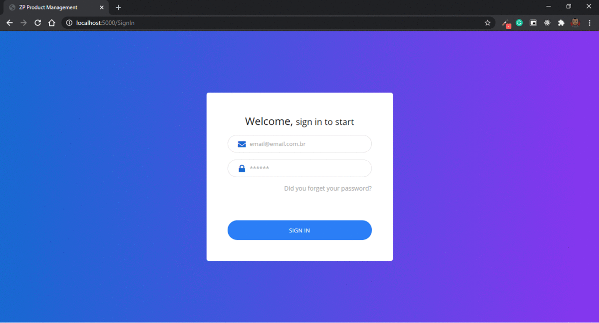

<h1 align="center">
  ZP Product Management
</h1>

<p align="center">
  <a href="#rocket-project">Project</a>&nbsp;&nbsp;&nbsp;|&nbsp;&nbsp;&nbsp;
  <a href="#computer-techs">Techs</a>&nbsp;&nbsp;&nbsp;|&nbsp;&nbsp;&nbsp;
  <a href="#thinking-how-to-use">How to use</a>&nbsp;&nbsp;&nbsp;|&nbsp;&nbsp;&nbsp;
  <a href="#memo-license">License</a>
</p>

## :rocket: Project

:file_folder: Product management.

### Preview

<p align="center">
    
</p>

### Functional Requirements

- [ ] The user can authenticate on application.

- [ ] The user can upload a list of files related to your products.

- [ ] The user can import a CSV in order to register new products.

- [ ] The user can view a paginated list of products.

- [ ] The user can view details about a product.

- [ ] The user can delete a product.

- [ ] The user can archive a product.

- [ ] The user can active a product

## :computer: Techs

- ASP.NET Core
- ASP.NET Core Identity
- C#
- CSS
- Dapper
- JavaScript
- Jquery
- MSSQL
- SQLite3

## :thinking: How to use

### Requirements

- ASP.NET Core 3.1
- SQL Server 2019
- Docker 19.03.8

### Local

```bash
$ git clone https://github.com/flaviogf/zp_product_management.git

$ cd zp_product_management

$ dotnet restore

# Ensure you had filling up the empty configurations in the appsettings.json file

$ dotnet run --project ./src/ZPProductManagement.Web
```

### Docker

```bash
$ git clone https://github.com/flaviogf/zp_product_management.git

$ cd zp_product_management

# Ensure you had filling up the empty configurations in the docker-compose.yml file

$ docker-compose up
```

## :memo: License

This project is under the GNU license. See more at [LICENSE](LICENSE) file for more information.
